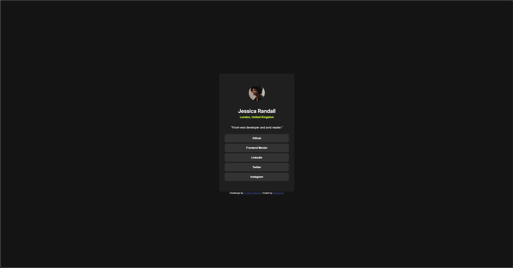

# Frontend Mentor - Social links profile solution

This is a solution to the [Social links profile challenge on Frontend Mentor](https://www.frontendmentor.io/challenges/social-links-profile-UG32l9m6dQ). Frontend Mentor challenges help you improve your coding skills by building realistic projects. 

## Table of contents

- [Overview](#overview)
  - [The challenge](#the-challenge)
  - [Screenshot](#screenshot)
- [My process](#my-process)
  - [Built with](#built-with)
  - [What I learned](#what-i-learned)
  - [Continued development](#continued-development)
  - [Useful resources](#useful-resources)
- [Author](#author)
- [Acknowledgments](#acknowledgments)

**Note: Delete this note and update the table of contents based on what sections you keep.**

## Overview

### The challenge

Users should be able to:

- See hover and focus states for all interactive elements on the page

### Screenshot

## My process

### Built with

- HTML5
- CSS

**Note: These are just examples. Delete this note and replace the list above with your own choices**

### What I learned

The main thing I focused on was flexboxes and how to use them. I learned how flex displays work, and how they can be used. In my case, I turned the body into one huge flex container and centered the div with all of the contact information on it. I also used the flexbox in order to center all the buttons, text, image, etc. on the center of the div.

### Continued development

I'll probably personalize this page more and make it a little more interactive, since it's pretty dull and boring right now.

### Useful resources

- [The Odin Project](https://www.theodinproject.com/lessons/foundations-introduction-to-flexbox) - Definitely very helpful resource for learning how flexboxes work.

